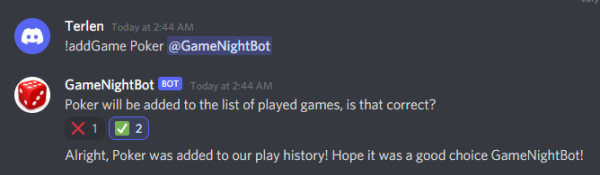
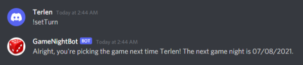

# GameNightBot

GameNightBot is a Discord bot that provides powerful utilities and record keeping for servers hosting community game nights.

## Features

### Queryable Game Data

GameNightBot utilizes a SQLite3 database to store data on players, games, and game outcomes. This allows individual server members to receive automated answers to common queries such as:

* What game did we play last week?

* Who picked that game we played on Saturday?

* Have we really never played Catan?

### Scheduling

GameNightBot provides scheduling tools to ensure nobody ever misses a game night again! Automated reminders and game master rotations provide all players with the information they need to come to each night prepared to play.

